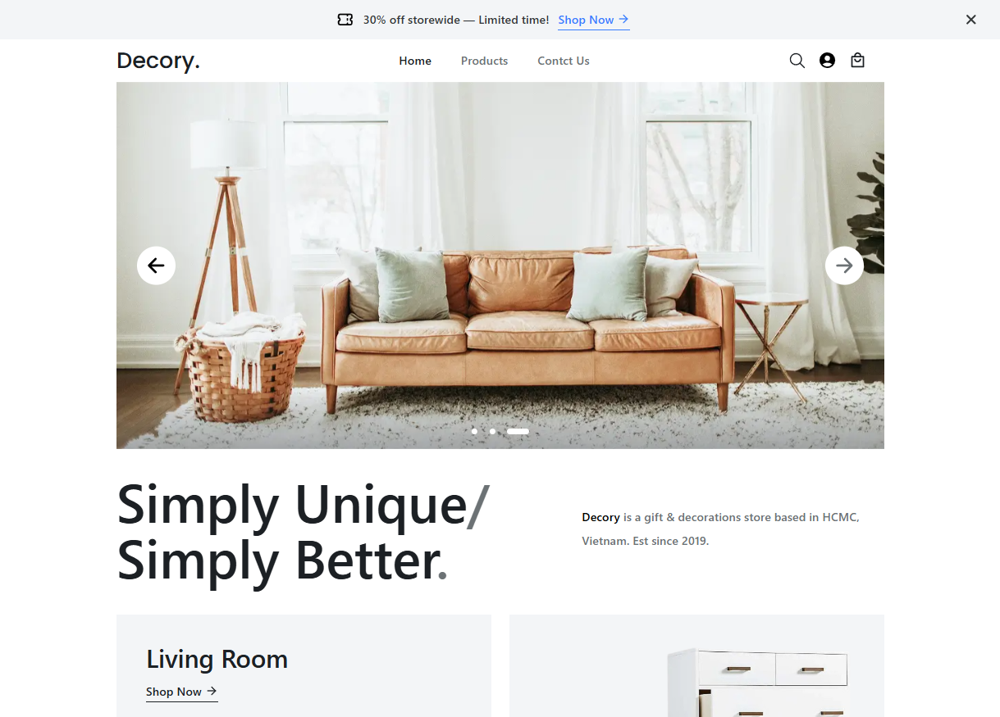

# 🛒 Decory — Full Stack E-commerce Decoration Store

**Decory** is a fully functional full-stack e-commerce store for home decoration products.  
This project was built from a public Figma design and developed using modern web technologies.  
It serves as a portfolio project to demonstrate my frontend skills through a complete user experience, including browsing, filtering, purchasing, and user account management.

---

## ✨ Features

### 🖥️ Frontend

- Fully responsive design (from mobile to large screens)
- Home page with featured products
- Products page:
  - "Show more" functionality
  - Search by name
  - Filter by category and price
- Product details page:
  - Image slider
  - Price, available colors, sizes, and size info
  - Reviews section (only logged-in users can write reviews)
  - Prevent selecting out-of-stock color/size
  - Prevent adding to cart if all stock is zero

### 🛒 Cart & Checkout

- Cart supports both guests and logged-in users
- Cart page with full item control
- Stripe payment integration

### 👤 User Account

- Login / Logout
- Orders page
- Address management
- Edit user profile (email, username, full name, password)
- Leave reviews on products (only for logged-in users)

### ⚙️ Admin (Strapi CMS)

- Add, update, and delete products dynamically
- Manage product variants (colors, sizes, stock)
- Moderate user reviews

---

## 🛠️ Tech Stack

- **Frontend:** React, Tailwind CSS, React Router, Context API, Reducer
- **Backend:** Strapi CMS
- **Database:** SQLite
- **Payments:** Stripe API

---

## 📸 Screenshot

Here’s a quick look at **Decory**:



---

## 📦 Installation & Setup

### 1. Clone the project

```bash
git clone https://github.com/black674/decory_ecommerce.git
```

### 2. Install dependencies

```bash
# Frontend
cd frontend
npm install

# Backend (Strapi)
cd ../backend
npm install
```

### 3. Setup environment variables

Create `.env` files in both the `frontend` and `backend` folders with the necessary keys and configurations (e.g. Stripe API keys, Strapi settings, etc.).

### 4. Run the project

```bash
# Frontend
cd frontend
npm run dev

# Backend (Strapi)
cd ../backend
npm run develop
```

---

## ⚠️ Notes

- This project was developed primarily as a **frontend portfolio showcase**.  
  The backend is powered by **Strapi**, which was used to enable dynamic product management.  
  While Strapi is powerful and flexible, this backend setup **was not designed for production use** and does not include full security hardening or backend validations.  
  There may be potential vulnerabilities if someone deliberately targets the server — however, this is outside the intended scope of the project.

- The design was created based on a public Figma layout, optimized from **mobile up to 1440px** screen width.  
  The UI still looks acceptable on wider screens (like 1920px), though **some elements may appear slightly smaller than usual**.  
  This was a conscious design compromise and still provides a usable and clean experience across all screen sizes.
